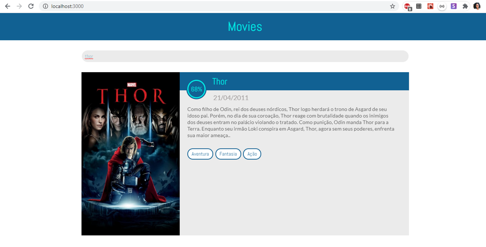
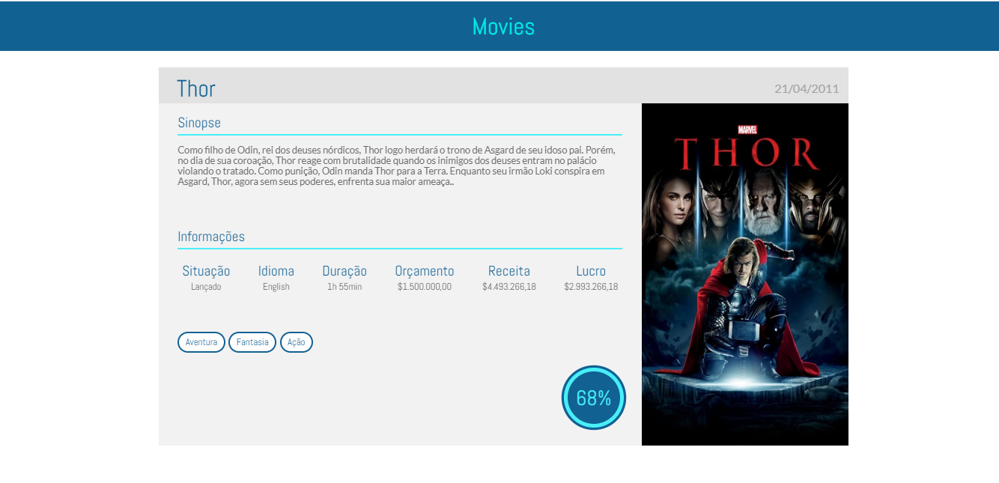
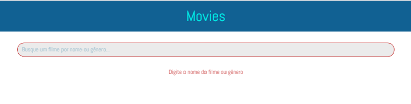
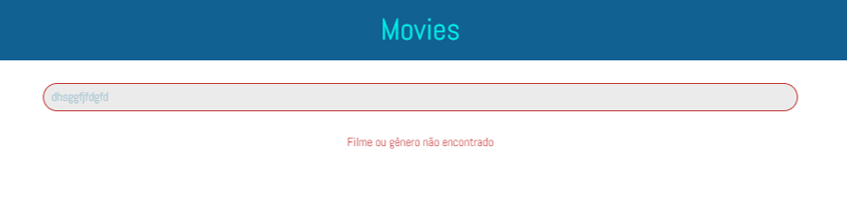

# Movies

> Web app responsivo que consome a API do The Movie DB e permite buscar e ver detalhes de filmes de seu catálogo.

# Instruções

* Clone este repositório
> $ git clone https://github.com/camillacorreia/desafio-movies.git

* Instale as dependências
> yarn install

* Execute a aplicação
> yarn start

---

   

   

   

   

---

Feito com 💜 por [Camilla Correia](https://www.linkedin.com/in/camilla-correia-3203a3139/)
